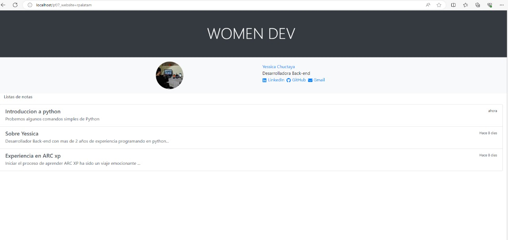
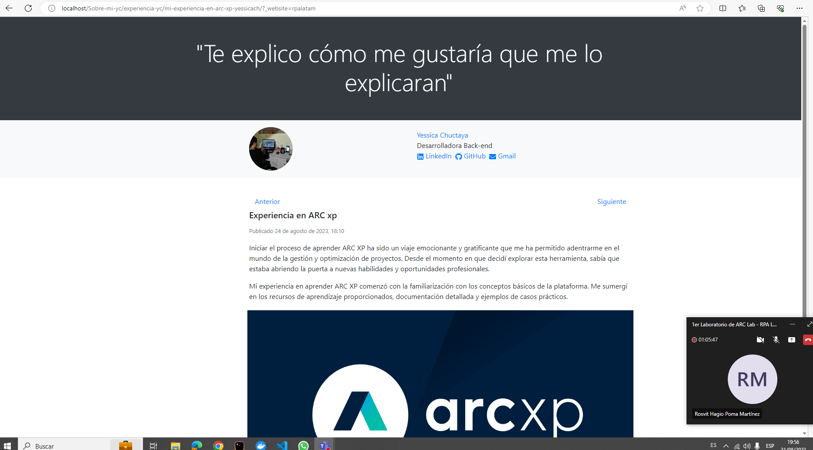

# Mini proyecto ARC XP 

## Capturas de Pantalla

## Descripción

En este proyecto, hemos creado una estructura básica utilizando Pagebuilder  y luego le hemos aplicado estilos usando boostrap.
 Puedes utilizar este código como punto de partida y personalizarlo según tus necesidades.

## Tecnologías Utilizadas

- ARC XP 
- Page Builder 
- Content source 

## Personalización

Puedes personalizar este proyecto de varias maneras:

- Cambiar los estilos en el archivo para que se ajusten a tu diseño preferido.

## Contribuciones

¡Las contribuciones son bienvenidas! Si encuentras errores o mejoras, siéntete libre de abrir un problema o enviar una solicitud de extracción en el repositorio.

